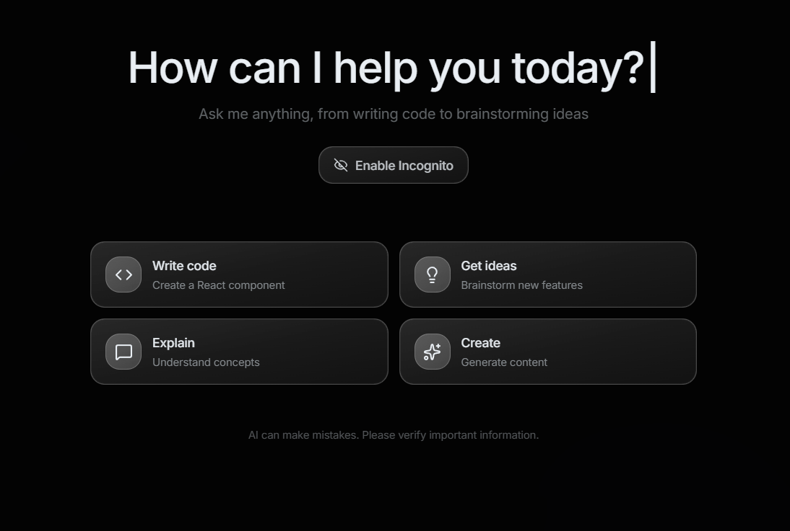
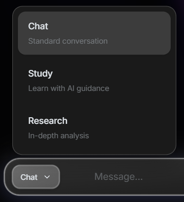
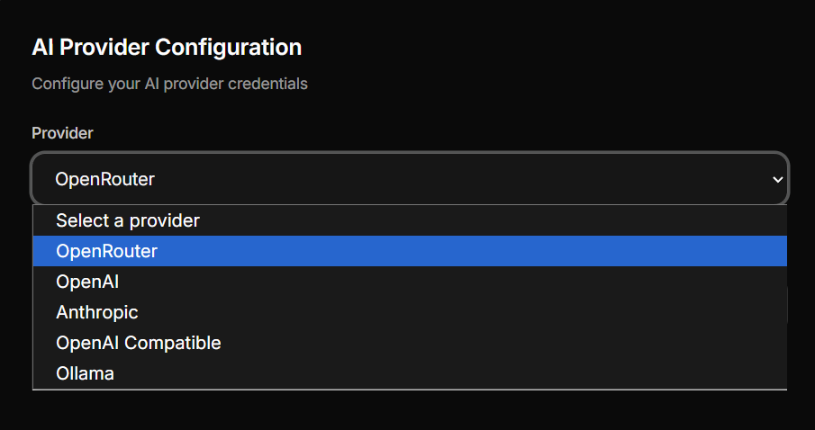
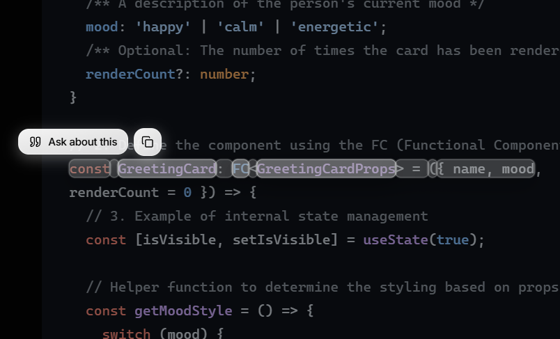
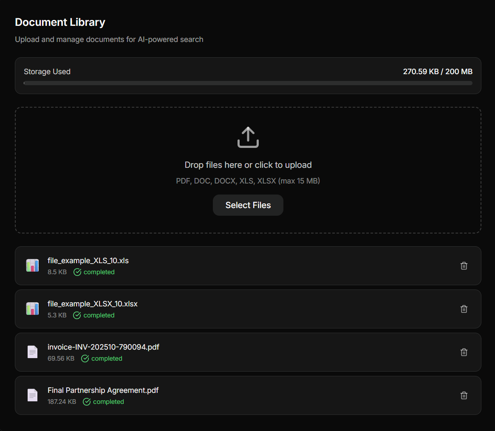
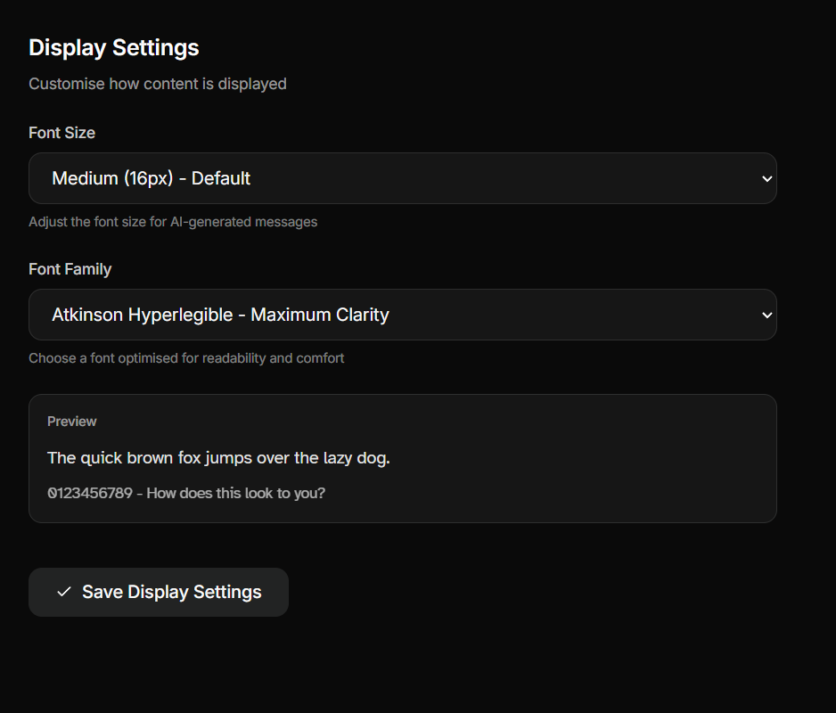
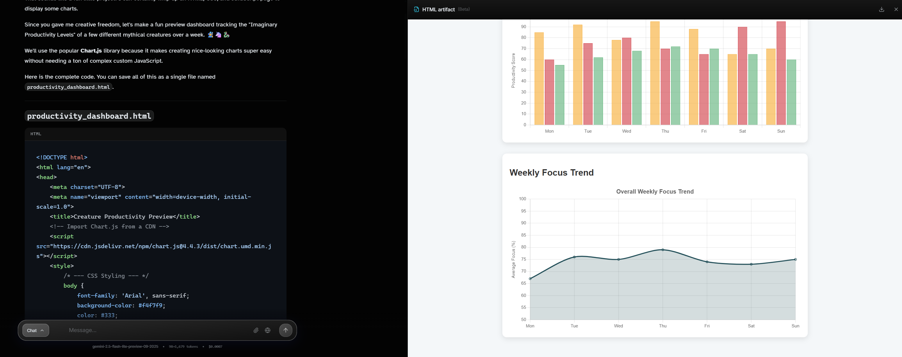

# AI Chat

> **⚠️ Beta Release**: This project is currently in beta. Some features or functions may not work or behave as expected. Please report any issues you encounter.

Full-stack TypeScript application: React + Vite frontend with an Express backend, featuring chat, document ingestion, embeddings, and provider settings.

## Features

### 🤖 AI & Chat
- **Multi-Provider Support**: OpenAI, Anthropic, OpenRouter, Ollama, and any OpenAI-compatible API
- **40+ AI Models**: GPT-4o, GPT-5, Claude, Gemini, Grok, DeepSeek, Qwen, and more
- **Three Chat Modes**:
  - 💬 **Chat Mode**: Standard conversational AI
  - 🔬 **Research Mode**: Deep research with web search, planning, and synthesis
  - 📚 **Study Mode**: Interactive learning with quizzes and hints
- **Web Search Integration**: Real-time web search with source citations
- **Streaming Responses**: Smooth, real-time message streaming
- **Smart Chat Titles**: AI-generated conversation titles
- **Incognito Mode**: Chat without saving history
- **Context Management**: Automatic token counting and cost tracking

### 📄 Document Intelligence (RAG)
- **Document Upload**: PDF, DOCX, XLSX/XLS support (up to 15MB per file)
- **Semantic Search**: Vector embeddings with cosine similarity
- **Smart Chunking**: Intelligent text segmentation with overlap
- **Document Querying**: Ask questions about your uploaded documents
- **Storage Management**: 200MB per-user storage with usage tracking
- **Background Processing**: Async document processing with status tracking

### 🎨 User Experience
- **Modern UI**: Beautiful, responsive design with Tailwind CSS
- **Dark Theme**: Eye-friendly dark mode interface
- **Smooth Animations**: Framer Motion powered transitions
- **Code Highlighting**: Syntax highlighting for 180+ languages
- **Math Rendering**: LaTeX/KaTeX support for mathematical notation
- **Markdown Support**: Full GFM (GitHub Flavored Markdown)
- **Message Editing**: Quote and reference previous messages
- **Split-Pane Artifacts**: Side-by-side view for generated content

### 🎨 Interactive Artifacts
- **HTML/CSS/JS Rendering**: Live preview of web pages with download capability
- **Python Execution**: Run Python code in-browser with Pyodide (no server needed)
- **Mermaid Diagrams**: Render flowcharts, sequence diagrams, and more
- **LaTeX Math**: Display complex mathematical equations with KaTeX
- **Syntax Highlighting**: Beautiful code display for all artifact types
- **Sandboxed Execution**: Safe, isolated environment for running code

### 🔐 Security & Privacy
- **User Authentication**: Secure JWT-based auth with HTTP-only cookies
- **Encrypted Storage**: AES-256-GCM encryption for API keys
- **Per-User Isolation**: Complete data separation between users
- **Secure Cookies**: sameSite=strict with secure flag in production
- **No Key Exposure**: API keys never sent to frontend

### ⚙️ Customization
- **Custom System Prompts**: Personalize AI behavior
- **Provider Settings**: Configure multiple AI providers
- **Model Selection**: Choose from 40+ models with pricing info
- **Embedding Models**: Multiple OpenAI embedding options
- **Display Name**: Personalized user experience
- **Onboarding Wizard**: Guided setup for new users

### 🛠️ Developer Features
- **TypeScript**: Full type safety across frontend and backend
- **SQLite Database**: Lightweight, embedded database
- **RESTful API**: Clean API architecture
- **Real-time Processing**: WebSocket-style streaming
- **Error Handling**: Comprehensive error management
- **CI/CD Ready**: GitHub Actions workflow included

## Screenshots

### Welcome Screen

*Clean, modern interface with animated background*

### Chat Modes

*Switch between Chat, Research, and Study modes seamlessly*

### AI Provider Selection

*Choose from 40+ models across multiple providers*

### Message Features

*Copy messages, ask follow-ups, and interact with AI responses*

### Document Library

*Upload and manage documents with RAG capabilities*

### Accessibility Features

*Customize font size and style for better readability*

### Interactive Artifacts

*Live HTML/CSS/JS rendering, Python execution, Mermaid diagrams, and LaTeX math in split-pane view*

## Quick Start

### 1. Install Dependencies

```bash
bun install
```

### 2. Configure Environment

```bash
cp .env.example .env.local
```

Edit `.env.local` and set your secrets:

```env
JWT_SECRET=your-secret-key-here
ENCRYPTION_KEY=your-32-byte-encryption-key
CORS_ORIGIN=http://localhost:5173
```

### 3. Run Locally

Open two terminals:

**Terminal 1 - Frontend (Vite dev server):**
```bash
bun run dev
```
Runs on `http://localhost:5173`

**Terminal 2 - Backend (Express server):**
```bash
bun run server:dev
```
Runs on `http://localhost:3001`

## Environment Variables

### Frontend (Vite)

| Variable | Description | Default |
|----------|-------------|---------|
| `VITE_API_BASE_URL` | Backend API base URL | `http://localhost:3001/api` |

### Server

| Variable | Description | Required | Default |
|----------|-------------|----------|---------|
| `NODE_ENV` | Environment mode | No | `development` |
| `PORT` | Express server port | No | `3001` |
| `CORS_ORIGIN` | Allowed origin for CORS | No | `http://localhost:5173` |
| `JWT_SECRET` | Secret for signing JWT tokens | **Yes (production)** | `dev-insecure-jwt-secret` |
| `ENCRYPTION_KEY` | 32+ byte key for encrypting API keys | **Yes** | - |
| `OPENAI_API_KEY` | Fallback OpenAI key (optional) | No | - |

### Document Processing

| Variable | Description | Default |
|----------|-------------|---------|
| `PDF_EXTRACTOR` | Force PDF extractor: `unpdf` or `pdfjs` | Auto-detect |
| `PDF_MAX_PAGES` | Max pages to extract from PDFs | `40` |
| `PDF_MAX_TEXT_CHARS` | Max characters from PDF text | `250000` |
| `DOC_MAX_TEXT_CHARS` | Max characters from documents | `300000` |
| `DOC_MAX_CHUNKS` | Max chunks per document | `200` |

## Scripts

| Command | Description |
|---------|-------------|
| `bun run dev` | Start Vite dev server (frontend) |
| `bun run server:dev` | Start Express server in watch mode |
| `bun run server` | Start Express server (no watch) |
| `bun run build` | Type-check and build frontend |
| `bun run preview` | Preview production build |
| `bun run lint` | Lint the codebase |

## Project Structure

```
aichatvtwo/
├── src/                      # Frontend React app
│   ├── components/           # React components
│   ├── contexts/             # React contexts
│   ├── pages/                # Page components
│   ├── services/             # API service layer
│   └── types/                # TypeScript types
├── server/                   # Backend Express app
│   ├── src/
│   │   ├── auth.ts           # Authentication logic
│   │   ├── chat.ts           # Chat proxy
│   │   ├── chats.ts          # Chat CRUD
│   │   ├── documents.ts      # Document processing
│   │   ├── embeddings.ts     # Embedding generation
│   │   ├── search.ts         # Web search
│   │   ├── server.ts         # Express server
│   │   ├── userSettings.ts   # User settings
│   │   ├── extractors/       # Document extractors
│   │   └── utils/            # Utilities
│   └── database/             # SQLite DB and uploads (gitignored)
├── .github/workflows/        # CI/CD workflows
└── .env.local                # Local environment (gitignored)
```

## Deployment

### Prerequisites

- Bun 1.0+ (or Node.js 20+ with npm)
- Persistent storage for database and uploads

### GitHub Actions CI

The project includes a CI workflow (`.github/workflows/ci.yml`) that:
- Installs dependencies
- Runs linter
- Builds frontend
- Type-checks server
- Runs security audit

### Production Environment

1. **Set required environment variables:**
   ```bash
   JWT_SECRET=<strong-random-secret>
   ENCRYPTION_KEY=<32-byte-key>
   CORS_ORIGIN=https://your-frontend-domain.com
   NODE_ENV=production
   ```

2. **Build the frontend:**
   ```bash
   bun run build
   ```
   This creates a `dist/` folder with static assets.

3. **Serve the frontend:**
   - Use a static hosting service (Vercel, Netlify, Cloudflare Pages)
   - Or serve via Express by adding static middleware

4. **Run the backend:**
   ```bash
   bun run server
   ```
   - Ensure `server/database/` is writable
   - Consider using PM2 or similar for process management

5. **Database persistence:**
   - The SQLite database is stored in `server/database/chat.db`
   - User uploads are in `server/database/uploads/`
   - Mount these directories to persistent storage in production

### Deployment Platforms

**Frontend:**
- Vercel, Netlify, Cloudflare Pages (static hosting)
- Set `VITE_API_BASE_URL` to your backend URL

**Backend:**
- Railway, Render, Fly.io, DigitalOcean App Platform
- Ensure persistent volumes for database and uploads
- Set all required environment variables

## Security

- 🔐 User API keys are encrypted at rest using AES-256-GCM
- 🍪 Authentication tokens are HTTP-only cookies with `sameSite=strict`
- 🔒 CORS restricted to configured origin
- 🛡️ JWT tokens required in production

See `SECURITY.md` for vulnerability reporting.

## Tech Stack

**Frontend:**
- React 19
- TypeScript
- Vite
- Tailwind CSS
- Framer Motion
- React Markdown with KaTeX

**Backend:**
- Express 5
- TypeScript
- SQLite (better-sqlite3)
- OpenAI SDK
- JWT authentication
- Multer for file uploads

## License

MIT

## Contributing

1. Fork the repository
2. Create a feature branch
3. Make your changes
4. Run `bun run lint` and `bun run build`
5. Submit a pull request